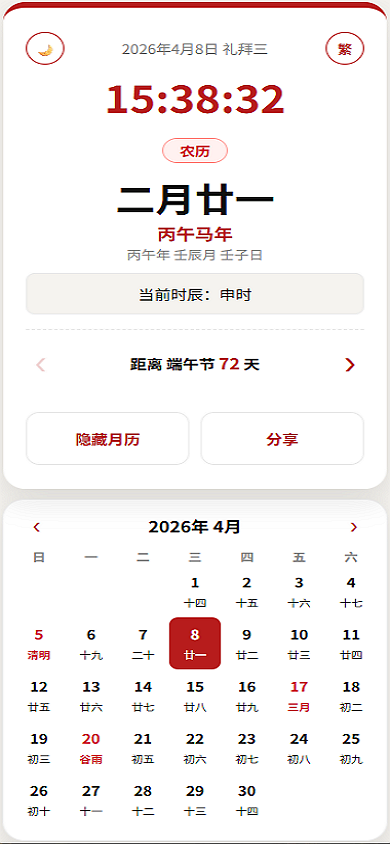
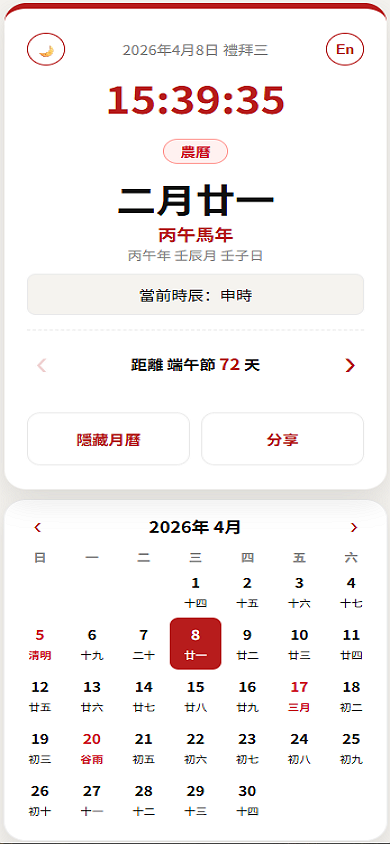
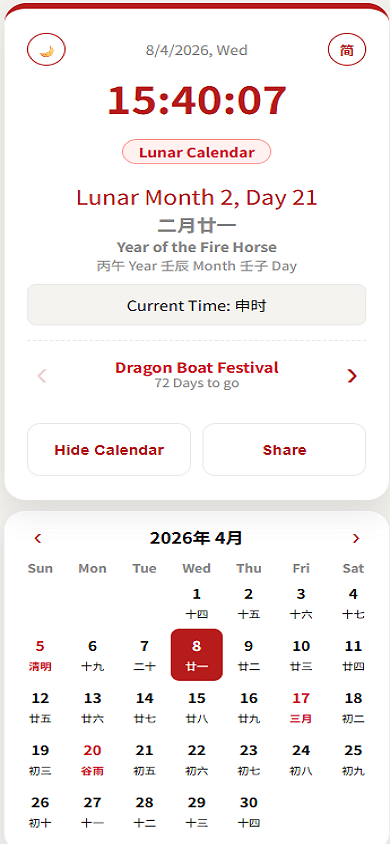

# 🏮 Diaspora-Friendly Lunar Calendar & Clock (PWA)
# 🏮 侨胞友好型农历时钟与月历 (PWA)

A minimalist, elegant, and highly functional Progressive Web App (PWA) designed for the global Chinese diaspora. This tool bridges traditional Chinese timekeeping with modern life, offering seamless localization across Simplified Chinese, Traditional Chinese, and English.

这是一个极简、优雅且功能强大的渐进式 Web 应用 (PWA)，专为全球华人侨胞设计。该工具将传统时辰与现代生活相结合，支持简体中文、繁体中文和英文的无缝切换。

**🔗 Live Demo / 访问链接:** [https://ytlim1.github.io/ChineseClockCalendar/](https://ytlim1.github.io/ChineseClockCalendar/)

---

### 💡 Preview / 预览

| 简体中文 (Simplified) | 繁體中文 (Traditional) | English (English) |
| :---: | :---: | :---: |
|  |  |  |

---

### ✨ Key Features / 核心功能

* **🌍 Tri-Language Localization / 三语本地化**: 
    * Seamlessly switch between **Simplified**, **Traditional**, and **English**.
    * 支持一键在**简体**、**繁体**和**英文**模式之间切换。
* **🕰️ Real-time Traditional Timekeeping / 实时传统时辰**: 
    * Displays Gregorian time alongside the **12 Shichen (时辰)**. 
    * **New:** Date headers now feature full day labels (e.g., 礼拜三 / 禮拜三).
    * 同步显示公历时间与**十二时辰**。日期标题现支持完整星期显示（如：礼拜三）。
* **📅 Intelligent Monthly Calendar / 智能交互月历**: 
    * **Smart Tooltips (En Mode Only)**: Hover over highlighted Solar Terms or Festivals in English mode to see translated names. Tooltips are hidden in Chinese modes to keep the UI clean.
    * **智能提示（仅限英文模式）**: 在英文模式下，悬停在高亮的节气或节日上可查看翻译。中文模式下自动隐藏提示，保持界面清爽。
    * **Unified Highlights**: Significant dates and Solar Terms remain highlighted across all three modes.
    * **统一高亮**: 节日与二十四节气在所有语言模式下均保持高亮。

---

### 📲 Mobile Installation / 手机安装指南 (PWA)

#### **For iOS (Safari) / 苹果浏览器 (Safari)**
1. **Open**: Launch Safari and go to the [Live Demo](https://ytlim1.github.io/ChineseClockCalendar/).  
   **打开**: 使用 Safari 浏览器访问应用链接。
2. **Share**: Tap the **Share** button (the square with an upward arrow) at the bottom of the screen.  
   **分享**: 点击屏幕底部的“分享”图标（方框加向上箭头的图标）。
3. **Add**: Scroll down and select **"Add to Home Screen"**.  
   **添加**: 向上滑动菜单，选择“添加到主屏幕”。
4. **Confirm**: Tap **Add** in the top-right corner to finish.  
   **确认**: 点击右上角的“添加”按钮即可完成。

#### **For Android (Chrome) / 安卓浏览器 (Chrome)**
1. **Open**: Launch Chrome and go to the [Live Demo](https://ytlim1.github.io/ChineseClockCalendar/).  
   **打开**: 使用 Chrome 浏览器访问应用链接。
2. **Menu**: Tap the **three dots** icon in the top-right corner.  
   **菜单**: 点击右上角的“三个点”菜单按钮。
3. **Install**: Select **"Install App"** or **"Add to Home Screen"**.  
   **安装**: 选择“安装应用”或“添加到主屏幕”。
4. **Confirm**: Follow the on-screen prompts to confirm the installation.  
   **确认**: 按照屏幕提示确认安装即可。

---

### 🛠️ Technical Stack / 技术栈

* **Algorithm Engine / 核心算法**: [lunar-javascript](https://6tail.cn/calendar/api.html).
* **Frontend / 前端**: Vanilla JavaScript (ES6+), HTML5, CSS3.
* **PWA**: `manifest.json` & Service Workers for offline access.

---

### 📄 License / 开源协议
This project is open-source and available under the **MIT License**.
本项目基于 **MIT 协议** 开源。
