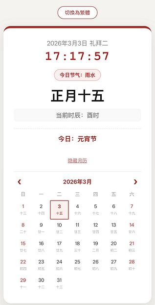

# 🏮 Chinese Lunar Clock & Calendar (PWA)

A minimalist and elegant web application that bridges the gap between the Gregorian calendar and traditional Chinese timekeeping. This project is built as a **Progressive Web App (PWA)**, allowing it to function seamlessly as a native-like app on your mobile device.

**🔗 Live Demo:** [https://ytlim1.github.io/ChineseClockCalendar/](https://ytlim1.github.io/ChineseClockCalendar/)

---

### ✨ Key Features

* **Real-time Traditional Timekeeping**: Displays the current time alongside the traditional **12 Shichen (时辰)** (e.g., Zi, Chou, Yin) based on solar time.
* **Dual Calendar Support**: Simultaneous display of Solar (Gregorian) and Lunar (Chinese) dates.
* **Solar Term Tracking**: Automatically identifies and displays the current of the **24 Solar Terms (节气)**.
* **Festival Countdown**: Features a dynamic countdown to major traditional festivals such as the Spring Festival, Lantern Festival, Dragon Boat Festival, and Mid-Autumn Festival.
* **One-Click Localization**: Instantly toggle the entire interface between **Simplified** and **Traditional Chinese**.
* **Interactive Monthly View**: Includes a built-in calendar with "Previous" and "Next" navigation to look up any lunar date.
* **Offline Capability**: Once visited, the app can be used offline thanks to Service Worker caching.

---

### 📲 Mobile Installation (PWA)

Since this app is a PWA, you can install it on your home screen without using the App Store or Google Play:

#### **For iOS (Safari)**
1.  Open the [Live Demo](https://ytlim1.github.io/ChineseClockCalendar/) in Safari.
2.  Tap the **Share** icon (the square with an upward arrow).
3.  Scroll down and select **"Add to Home Screen"**.

#### **For Android (Chrome)**
1.  Open the [Live Demo](https://ytlim1.github.io/ChineseClockCalendar/) in Chrome.
2.  Tap the **three dots** in the top-right corner.
3.  Select **"Install App"** or **"Add to Home Screen"**.

---

### 🛠️ Technical Stack

* **Algorithm Engine**: Powered by the [lunar-javascript](https://6tail.cn/calendar/api.html) library for high-precision lunar calculations.
* **Frontend**: Pure HTML5, CSS3, and Vanilla JavaScript (ES6+).
* **PWA Core**: Uses `manifest.json` and `sw.js` (Service Workers) for app-like behavior and offline access.

---

### 📄 License
This project is open-source and available under the **MIT License**.

---

### 💡 Preview

---

# 🏮 Chinese Lunar Clock & Calendar (PWA)

一个极简、优雅的 Web 应用，旨在连接公历与传统农历时辰。它不仅是一个万年历，更是一个可以安装在手机上的 **Progressive Web App (PWA)**。

**🔗 访问链接:** [https://ytlim1.github.io/ChineseClockCalendar/](https://ytlim1.github.io/ChineseClockCalendar/)

---

### ✨ 核心功能

* **实时时辰显示**: 除了公历时间，还同步显示当前的传统 **12 时辰**（如：子时、丑时等）。
* **双历对照**: 同时显示公历（阳历）日期与农历（阴历）日期。
* **节气追踪**: 自动计算并显示当前所属的 **24 节气**。
* **节日倒计时**: 智能计算并展示距离春节、元宵节、端午节、中秋节的剩余天数。
* **简繁切换**: 支持一键在简体中文与繁体中文之间切换。
* **交互式月历**: 内置动态月历，支持查看过去与未来的月份。

---

### 📲 手机安装指南 (PWA)

本项目作为 Progressive Web App 开发，无需通过应用商店，即可直接“安装”到手机桌面：

#### **iOS (iPhone/iPad)**
1. 使用 **Safari** 浏览器打开 [Live Demo](https://ytlim1.github.io/ChineseClockCalendar/)。
2. 点击底部的 **分享** 按钮（方框加向上箭头的图标）。
3. 向上滑动菜单，选择 **“添加到主屏幕”**。

#### **Android**
1. 使用 **Chrome** 浏览器打开 [Live Demo](https://ytlim1.github.io/ChineseClockCalendar/)。
2. 点击右上角的 **三个点** 菜单按钮。
3. 选择 **“安装应用”** 或 **“添加到主屏幕”**。

---

### 🛠️ 技术栈

* **核心算法**: 基于 [lunar-javascript](https://6tail.cn/calendar/api.html) 高精度历法库。
* **开发模式**: HTML5 + CSS3 + Vanilla JavaScript (ES6+)。
* **离线能力**: 使用 Service Workers 实现 PWA 离线缓存。

---

### 📄 开源协议
本项目基于 **MIT 协议** 开源。欢迎交流与改进。

---

### 💡 运行截图
*(你可以将你的截图文件上传到仓库，然后在此处添加图片链接，例如: 

一个极简、优雅的 Web 应用，旨在连接公历与传统农历时辰。它不仅是一个万年历，更是一个可以安装在手机上的 **Progressive Web App (PWA)**。

**🔗 访问链接:** [https://ytlim1.github.io/ChineseClockCalendar/](https://ytlim1.github.io/ChineseClockCalendar/)

---

### ✨ 核心功能

* **实时时辰显示**: 除了公历时间，还同步显示当前的传统 **12 时辰**（如：子时、丑时等）。
* **双历对照**: 同时显示公历（阳历）日期与农历（阴历）日期。
* **节气追踪**: 自动计算并显示当前所属的 **24 节气**。
* **节日倒计时**: 智能计算并展示距离春节、元宵节、端午节、中秋节的剩余天数。
* **简繁切换**: 支持一键在简体中文与繁体中文之间切换。
* **交互式月历**: 内置动态月历，支持查看过去与未来的月份。

---

### 📲 手机安装指南 (PWA)

本项目作为 Progressive Web App 开发，无需通过应用商店，即可直接“安装”到手机桌面：

#### **iOS (iPhone/iPad)**
1. 使用 **Safari** 浏览器打开 [Live Demo](https://ytlim1.github.io/ChineseClockCalendar/)。
2. 点击底部的 **分享** 按钮（方框加向上箭头的图标）。
3. 向上滑动菜单，选择 **“添加到主屏幕”**。

#### **Android**
1. 使用 **Chrome** 浏览器打开 [Live Demo](https://ytlim1.github.io/ChineseClockCalendar/)。
2. 点击右上角的 **三个点** 菜单按钮。
3. 选择 **“安装应用”** 或 **“添加到主屏幕”**。

---

### 🛠️ 技术栈

* **核心算法**: 基于 [lunar-javascript](https://6tail.cn/calendar/api.html) 高精度历法库。
* **开发模式**: HTML5 + CSS3 + Vanilla JavaScript (ES6+)。
* **离线能力**: 使用 Service Workers 实现 PWA 离线缓存。

---

### 📄 开源协议
本项目基于 **MIT 协议** 开源。欢迎交流与改进。

---

### 💡 运行截图

